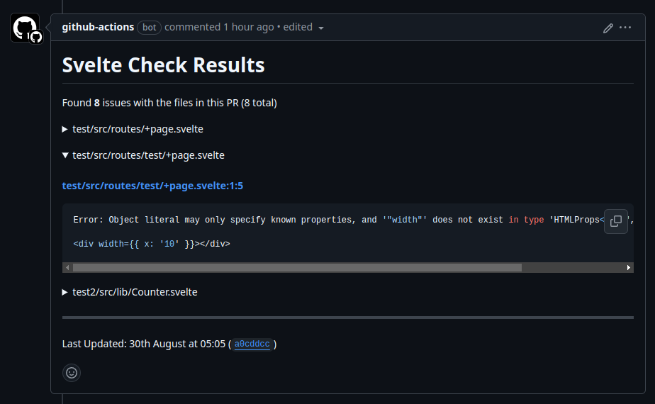

# Svelte Check Action

Enhance your [svelte-check](http://npmjs.com/svelte-check) experience in GitHub actions by adding both comments and annotations to your PRs.

```yaml
name: Svelte Check

on:
    - pull_request

permissions: {}

jobs:
    svelte-check:
        runs-on: ubuntu-latest
        permissions:
            pull-requests: write # Required to be able to comment on PRs
        steps:
            - name: Checkout
              uses: actions/checkout@v4

            # You can replace these steps with your specific setup steps
            # This example assumes Node 22 and pnpm 10
            - name: Setup Node 22
              uses: actions/setup-node@v4
              with:
                  node-version: 22
                  registry-url: https://registry.npmjs.org/

            - name: Setup PNPM
              uses: pnpm/action-setup@v4.1.0
              with:
                  version: 10.11.1

            - name: Install
              run: pnpm install

            # Run the svelte check action
            - name: Svelte Check
              uses: ghostdevv/svelte-check-action@v1
```

This will add a comment to your PRs with any errors, for example:



and annotations to your changed files tab:


## Options

By default the action will only check files that are changed in the pull request. You can customise this behaviour by using the following options:

| Option          | Description                                                                                                                                                                | Default               |
| --------------- | -------------------------------------------------------------------------------------------------------------------------------------------------------------------------- | --------------------- |
| `paths`         | The folder(s) to run `svelte-check` in, one per line. `svelte-kit sync` will be ran before diagnostics if SvelteKit is found at the folder package.json.                   | `.`                   |
| `filterChanges` | When enabled only the files that change in the pull request will be checked. If a list of globs is provided, we will only apply this filtering to files matching the globs | `false`               |
| `failOnError`   | Should the action fail if there is a svelte-check error?                                                                                                                   | `true`                |
| `failOnWarning` | Should the action fail if there is a svelte-check warning?                                                                                                                 | `false`               |
| `failFilter`    | When `failFilter` is set and either `failOnError` or `failOnWarning` is enabled, the action will only fail on files that match the filter.                                 | Disabled              |
| `token`         | The GitHub token used to authenticate with the GitHub API. By default we use the unique token GitHub generates for each workflow run.                                      | `${{ github.token }}` |

You can configure the action by passing the options under the `with` key, for example:

```yaml
- name: Svelte Check
  uses: ghostdevv/svelte-check-action@v1
  with:
      paths: |
          ./packages/app
```

## Deprecated Options (will be removed in next major release)

- Setting `GITHUB_TOKEN` environment variable is deprecated, please remove it completely if you want to use the default token managed by GitHub - or set your own using the `token` option.
